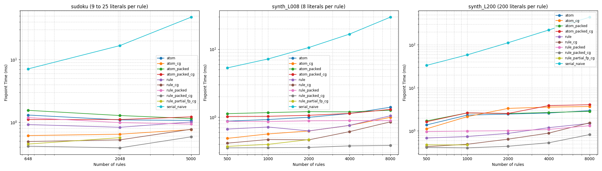

# Scaling Report

Propagation time against the number of rules, for each variant. Each point is the sum of the NVTX `fixpoint` ranges of one execution, taken as the median over the repetitions; the `serial_naive` baseline has no NVTX range, so its wall time is used instead.

The `synth_L008` and `synth_L200` families have the same shape and the same number of fixpoint iterations, and differ only in the number of literals per rule: 8 literals fit in one tile, 200 force a tile to scan the rule in several passes.

## sudoku

|   Rules |    atom |   atom_cg |   atom_packed |   atom_packed_cg |     rule |   rule_cg |   rule_packed |   rule_packed_cg |   rule_partial_fp_cg |   serial_naive |
|--------:|--------:|----------:|--------------:|-----------------:|---------:|----------:|--------------:|-----------------:|---------------------:|---------------:|
|     648 | 1.30107 |  0.611774 |       1.54722 |          1.10295 | 0.916934 |  0.49124  |      1.18327  |         0.413112 |             0.4476   |        7.10858 |
|    2048 | 1.08852 |  0.643282 |       1.2778  |          1.10255 | 0.829036 |  0.521876 |      0.984616 |         0.388956 |             0.565592 |       16.7487  |
|    5000 | 1.06744 |  0.761632 |       1.14535 |          1.21752 | 1.0065   |  0.771152 |      0.933444 |         0.583452 |           nan        |       47.6724  |

## synth_L008

|   Rules |     atom |   atom_cg |   atom_packed |   atom_packed_cg |     rule |   rule_cg |   rule_packed |   rule_packed_cg |   rule_partial_fp_cg |   serial_naive |
|--------:|---------:|----------:|--------------:|-----------------:|---------:|----------:|--------------:|-----------------:|---------------------:|---------------:|
|     500 | 0.875252 |  0.489436 |       1.12891 |          1.02587 | 0.669736 |  0.416116 |      0.86995  |         0.354718 |             0.372866 |        5.31488 |
|    1000 | 0.925528 |  0.568194 |       1.1699  |          1.0325  | 0.718382 |  0.470374 |      0.862806 |         0.356902 |             0.399372 |        7.18855 |
|    2000 | 0.997658 |  0.628152 |       1.20855 |          1.06794 | 0.629314 |  0.465244 |      0.885034 |         0.359806 |             0.468528 |       10.5837  |
|    4000 | 1.13283  |  0.757602 |       1.19748 |          1.13766 | 0.75919  |  0.614282 |      0.892302 |         0.378944 |           nan        |       16.685   |
|    8000 | 1.40172  |  0.995696 |       1.26752 |          1.30527 | 1.05003  |  0.855176 |      0.890584 |         0.385226 |           nan        |       29.5621  |

## synth_L200

|   Rules |    atom |   atom_cg |   atom_packed |   atom_packed_cg |     rule |   rule_cg |   rule_packed |   rule_packed_cg |   rule_partial_fp_cg |   serial_naive |
|--------:|--------:|----------:|--------------:|-----------------:|---------:|----------:|--------------:|-----------------:|---------------------:|---------------:|
|     500 | 1.37317 |   1.11602 |       1.70014 |          1.62543 | 0.681306 |  0.42892  |      0.961062 |         0.41181  |             0.47205  |        33.2521 |
|    1000 | 2.32017 |   2.13911 |       2.6088  |          2.61685 | 0.7374   |  0.487974 |      0.98876  |         0.40206  |             0.470486 |        58.4478 |
|    2000 | 2.45053 |   3.32354 |       2.52256 |          2.53689 | 0.87199  |  0.64068  |      1.00676  |         0.43783  |           nan        |       111.701  |
|    4000 | 2.59281 |   3.57254 |       2.67492 |          3.86303 | 1.18645  |  0.885956 |      1.079    |         0.528032 |           nan        |       221.065  |
|    8000 | 2.9492  |   3.67508 |       2.83249 |          4.05072 | 1.49028  |  1.5382   |      1.31767  |         0.817308 |           nan        |       438.796  |

## Scaling Graph

