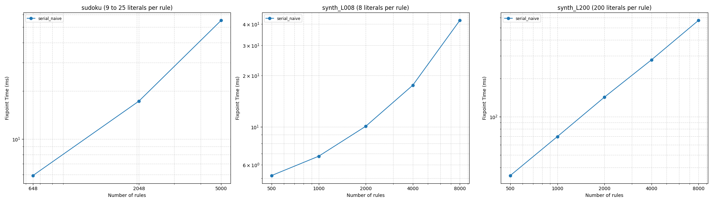

# Scaling Report

Propagation time against the number of rules, for each variant. Each point is the sum of the NVTX `fixpoint` ranges of one execution, taken as the median over the repetitions; the `serial_naive` baseline has no NVTX range, so its wall time is used instead.

The `synth_L008` and `synth_L200` families have the same shape and the same number of fixpoint iterations, and differ only in the number of literals per rule: 8 literals fit in one tile, 200 force a tile to scan the rule in several passes.

## sudoku

|   Rules |   serial_naive |
|--------:|---------------:|
|     648 |         5.9173 |
|    2048 |        17.2599 |
|    5000 |        55.098  |

## synth_L008

|   Rules |   serial_naive |
|--------:|---------------:|
|     500 |         5.2005 |
|    1000 |         6.7441 |
|    2000 |        10.0941 |
|    4000 |        17.5414 |
|    8000 |        42.0189 |

## synth_L200

|   Rules |   serial_naive |
|--------:|---------------:|
|     500 |        34.526  |
|    1000 |        69.7751 |
|    2000 |       142.315  |
|    4000 |       279.261  |
|    8000 |       569.95   |

## Scaling Graph

